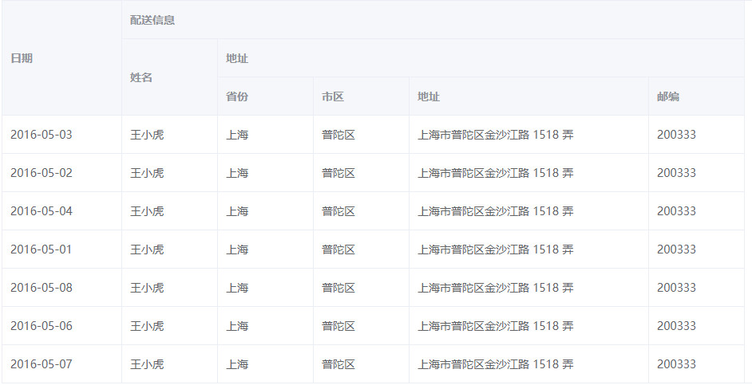

# VueTable 导出表格

## Vue2 版本

### (1) 安装包依赖

```javascript
cnpm i lay-excel -S
```

### (2) 在组件里面引入

```javascript
import LAY_EXCEL from 'lay-excel';
```

### (3) 获取到数据后插入表头

- 这里的 tabledata 就是表格中的数据

- 插入的头部要依据自定义表头的规则来定,比如我这里表格的第一列就日期和配送信息,表格的第二列就姓名,地址如图所示



- 代码如下

> 先把所有的列头列出来，从下往上一步步合并

```javascript
let result = JSON.parse(JSON.stringify(_this.tableData));
result.unshift({
  date: '日期',
  name: '姓名',
  province: '省份',
  city: '市区',
  address: '详细地址',
  zip: '邮编',
});
result.unshift({
  date: '日期',
  name: '姓名',
  province: '地址',
  city: '',
  address: '',
  zip: '',
});
result.unshift({
  date: '日期',
  name: '配送信息',
  province: '',
  city: '',
  address: '',
  zip: '',
});
```

### (4)设置样式的函数

- result 就是刚才加入表头后的数据

- A1:F10 就是范围区间

- 回调函数还有待研究

- 当你想设置第二次覆盖前面的时候可以写第二次但要注意范围区间

```javascript
//设置样式的函数
LAY_EXCEL.setExportCellStyle(result, 'A1:F10', {
  s: {
    fill: { bgColor: { rgb: 'cc0000' }, fgColor: { rgb: '157EE2' } },
    font: {
      color: {
        rgb: 'FCDD7C',
      },
      sz: '28',
      bold: true,
    },
    alignment: {
      horizontal: 'center',
      vertical: 'center',
    },
    border: {
      top: { style: 'thin', color: { rgb: 'FFFF0000' } },
      bottom: { style: 'thin', color: { rgb: 'FFFF0000' } },
      left: { style: 'thin', color: { rgb: 'FFFF0000' } },
      right: { style: 'thin', color: { rgb: 'FFFF0000' } },
    },
  },
  // 回调参数，cell:原有数据，newCell:根据批量设置规则自动生成的样式，row:所在行数据，config:传入的配置,currentRow:当前行索引,currentCol:当前列索引，fieldKey:当前字段索引
  function(cell, newCell, row, config, currentRow, currentCol, fieldKey) {
    console.log(cell, newCell, row, config, currentRow, currentCol, fieldKey);
    return currentRow % 2 == 0 ? newCell : cell; // 隔行隔列上色
  },
});
```

### (5) 单元格合并,设定列宽,行高

- 合并行:数组里面都是起始位置和终结位置

- 列宽 A:300

- 行高:特定的放到对象里面,普遍的放到外面

```javascript
//设置合并的列宽
var mergeConf = LAY_EXCEL.makeMergeConfig([
  ['A1', 'A3'],
  ['B1', 'F1'],
  ['B2', 'B3'],
  ['C2', 'F2'],
]); //从开头到结束
var colConf = LAY_EXCEL.makeColConfig({
  A: 300,
  B: 200,
  C: 100,
  D: 200,
  E: 600,
  F: 300,
});
// var rowConf = LAY_EXCEL.makeRowConfig({ 0: 300, 4: 1000 }, 200);  //第0行300高,第4行1000高 其余200高
```

### (6) 导出 excel

- 第一页对应的就是 sheet1,你可以起任何名字,对应的下面的 extends 也是对应的

- 第二个是表格名称

- 第三个是类型

- 第四个是继承

```javascript
LAY_EXCEL.exportExcel(
  {
    第一页: result,
  },
  '表格导出.xlsx',
  'xlsx',
  {
    extend: {
      // extend 中可以指定某个 sheet 的属性，如果不指定 sheet 则所有 sheet 套用同一套属性
      第一页: {
        // 以下配置仅 sheet1 有效
        '!merges': mergeConf,
        '!cols': colConf,
        // '!rows': rowConf
      },
    },
  }
);
```

### (7) 完整版

```javascript

<template>
  <div>
    {{message}}---{{url}}
    <span v-if="this.$route.query.id">从about页面接收过来的值是{{this.$route.query.id}}</span>
    <el-button type="primary"
               @click="gotourl">点击跳转到About页面</el-button>
    <el-button @click="gotoexcel">导出表格</el-button>
    <div class="content">
      <el-table :data="tableData"
                style="width: 100%">
        <el-table-column prop="date"
                         label="日期"
                         width="150">
        </el-table-column>
        <el-table-column label="配送信息">
          <el-table-column prop="name"
                           label="姓名"
                           width="120">
          </el-table-column>
          <el-table-column label="地址">
            <el-table-column prop="province"
                             label="省份"
                             width="120">
            </el-table-column>
            <el-table-column prop="city"
                             label="市区"
                             width="120">
            </el-table-column>
            <el-table-column prop="address"
                             label="地址"
                             width="300">
            </el-table-column>
            <el-table-column prop="zip"
                             label="邮编"
                             width="120">
            </el-table-column>
          </el-table-column>
        </el-table-column>
      </el-table>
    </div>
  </div>
</template>

<script>
import url from '../config'
import LAY_EXCEL from 'lay-excel';
export default {
  data () {
    return {
      message: "首页",
      url: url.homeurl,
      tableData: [{
        date: '2016-05-03',
        name: '王小虎',
        province: '上海',
        city: '普陀区',
        address: '上海市普陀区金沙江路 1518 弄',
        zip: 200333
      }, {
        date: '2016-05-02',
        name: '王小虎',
        province: '上海',
        city: '普陀区',
        address: '上海市普陀区金沙江路 1518 弄',
        zip: 200333
      }, {
        date: '2016-05-04',
        name: '王小虎',
        province: '上海',
        city: '普陀区',
        address: '上海市普陀区金沙江路 1518 弄',
        zip: 200333
      }, {
        date: '2016-05-01',
        name: '王小虎',
        province: '上海',
        city: '普陀区',
        address: '上海市普陀区金沙江路 1518 弄',
        zip: 200333
      }, {
        date: '2016-05-08',
        name: '王小虎',
        province: '上海',
        city: '普陀区',
        address: '上海市普陀区金沙江路 1518 弄',
        zip: 200333
      }, {
        date: '2016-05-06',
        name: '王小虎',
        province: '上海',
        city: '普陀区',
        address: '上海市普陀区金沙江路 1518 弄',
        zip: 200333
      }, {
        date: '2016-05-07',
        name: '王小虎',
        province: '上海',
        city: '普陀区',
        address: '上海市普陀区金沙江路 1518 弄',
        zip: 200333
      }]
    }
  },
  methods: {
    gotourl () {
      this.$router.push({
        path: "/about",
        query: {
          id: 1
        }
      })
    },
    gotoexcel () {
      console.log('点击了导出')
      let _this = this;
      let result = JSON.parse(JSON.stringify(_this.tableData))
      result.unshift({ date: '日期', name: "姓名", province: "省份", city: "市区", address: "详细地址", zip: "邮编" })
      result.unshift({ date: '日期', name: "姓名", province: "地址", city: "", address: "", zip: "" })
      result.unshift({ date: '日期', name: "配送信息", province: "", city: "", address: "", zip: "" })

      //设置样式的函数
      LAY_EXCEL.setExportCellStyle(result, 'A1:F10', {
        s: {
          fill: { bgColor: { rgb: "cc0000" }, fgColor: { rgb: "157EE2" } },
          font: {
            color: {
              rgb: "FCDD7C"
            },
            sz: "28",
            bold: true
          },
          alignment: {
            horizontal: 'center',
            vertical: 'center'
          },
          border: {
            top: { style: 'thin', color: { rgb: 'FFFF0000' } },
            bottom: { style: 'thin', color: { rgb: 'FFFF0000' } },
            left: { style: 'thin', color: { rgb: 'FFFF0000' } },
            right: { style: 'thin', color: { rgb: 'FFFF0000' } }
          }
        },
        // 回调参数，cell:原有数据，newCell:根据批量设置规则自动生成的样式，row:所在行数据，config:传入的配置,currentRow:当前行索引,currentCol:当前列索引，fieldKey:当前字段索引
        function (cell, newCell, row, config, currentRow, currentCol, fieldKey) {
          console.log(cell, newCell, row, config, currentRow, currentCol, fieldKey)
          return currentRow % 2 == 0 ? newCell : cell;// 隔行隔列上色
        }
      })

      LAY_EXCEL.setExportCellStyle(result, 'F4:F10', {
        s: {
          fill: { bgColor: { rgb: "FFE793" }, fgColor: { rgb: "FFE793" } },
          font: {
            color: {
              rgb: "0076B8"
            },
            sz: "28",
            bold: true
          },
          alignment: {
            horizontal: 'center',
            vertical: 'center'
          },
          border: {
            top: { style: 'thin', color: { rgb: 'FFFF0000' } },
            bottom: { style: 'thin', color: { rgb: 'FFFF0000' } },
            left: { style: 'thin', color: { rgb: 'FFFF0000' } },
            right: { style: 'thin', color: { rgb: 'FFFF0000' } }
          }
        },
        // 回调参数，cell:原有数据，newCell:根据批量设置规则自动生成的样式，row:所在行数据，config:传入的配置,currentRow:当前行索引,currentCol:当前列索引，fieldKey:当前字段索引
        function (cell, newCell, row, config, currentRow, currentCol, fieldKey) {
          console.log(cell, newCell, row, config, currentRow, currentCol, fieldKey)
          return currentRow % 2 == 0 ? newCell : cell;// 隔行隔列上色
        }
      })


      var mergeConf = LAY_EXCEL.makeMergeConfig([['A1', 'A3'], ['B1', 'F1'], ['B2', 'B3'], ['C2', 'F2']]); //从开头到结束
      var colConf = LAY_EXCEL.makeColConfig({ 'A': 300, 'B': 200, 'C': 100, 'D': 200, 'E': 600, 'F': 300 });
      // var rowConf = LAY_EXCEL.makeRowConfig({ 0: 300, 4: 1000 }, 200);  //第0行

      LAY_EXCEL.exportExcel(
        {
          '第一页': result,

        },
        '表格导出.xlsx',
        'xlsx',
        {
          extend: {
            // extend 中可以指定某个 sheet 的属性，如果不指定 sheet 则所有 sheet 套用同一套属性
            '第一页': {
              // 以下配置仅 sheet1 有效
              '!merges': mergeConf,
              '!cols': colConf,
              // '!rows': rowConf
            }
          }
        }
      )
    }
  }
}
</script>

<style lang="less" scoped>
.content {
  margin-top: 100px;
}
</style>

```

### (8)VUE2 同 Vue 3
